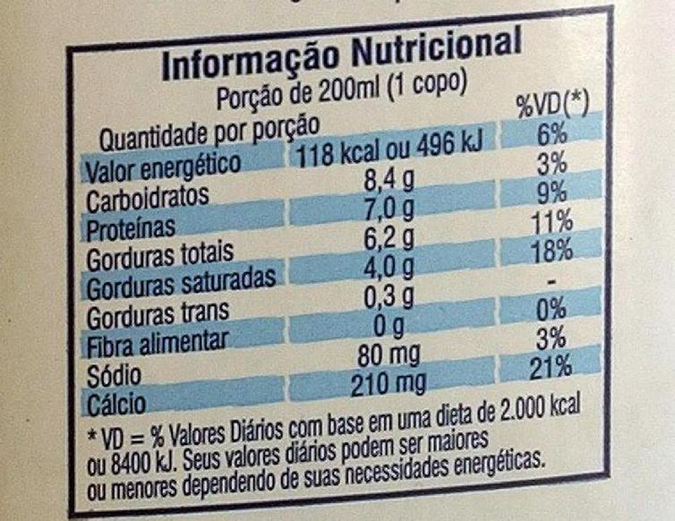
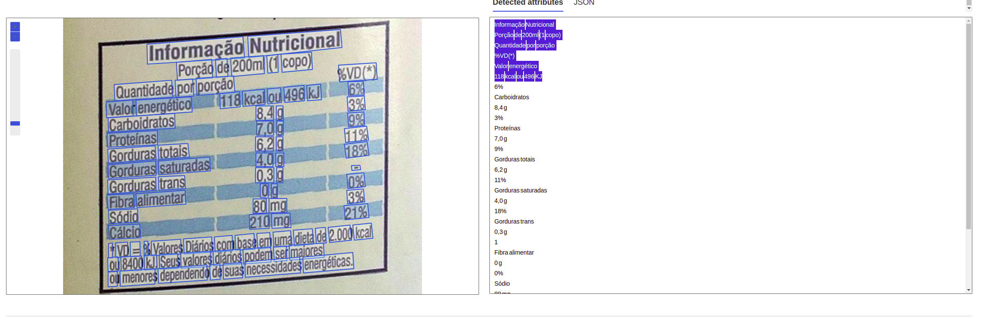
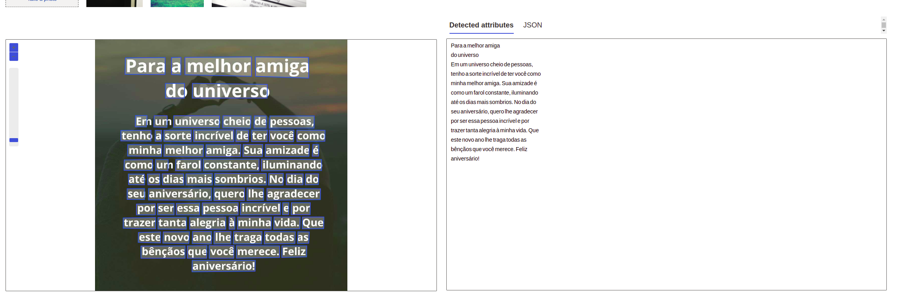

# Lab Azure AI Vision Service
Resultados obtidos com os testes do serviço de Visão Computacional da Microsoft Azure. Testadas as capacidades de reconhecimento/extração de texto em imagens no serviço.

## Imagens Analisadas
Foram textadas 2 imagens

### Imagem 1 - Rótulo de Alimento.

Observe que a imagem possui uma leve inclinação no seu eixo, o que não prejudicou o reconhecimento do texto na imagem.



A imagem reconhecida no serviço na visão da interface de teste do Azure:


O JSON gerado é muito grande, então apresento um pequeno trecho com o que vamos destacar:

Note que o JSON apresenta em sua estrutura um *array* chamado **lines** que irá conter os textos obtidos na perspectiva linear. O *array* contém os elements *text*, que é o texto reconhecido na linha, e uma matriz *words*, que apresenta informações sobre cada palavra da linha.

Em ambos os elementos (*text* e *words*), o JSON apresenta informações da área em que o texto foi detectado, e às adiciona sob formas de coordenadas x,y sob o *array* **boundingPolygon**. Para cada palavra no *array* **word** também é adicionada uma espécide taxa percentual de confiança do texto reconhecido, que varia de 0 a 1 (sendo 1 100%) - por exemplo: "confidence": 0.993

Trecho do JSON gerado para a imagem
```json

[
  {
    "lines": [
      {
        "text": "Informação Nutricional",
        "boundingPolygon": [
          {
            "x": 175,
            "y": 54
          },
          {
            "x": 583,
            "y": 23
          },
          {
            "x": 586,
            "y": 66
          },
          {
            "x": 177,
            "y": 97
          }
        ],
        "words": [
          {
            "text": "Informação",
            "boundingPolygon": [
              {
                "x": 176,
                "y": 55
              },
              {
                "x": 378,
                "y": 39
              },
              {
                "x": 381,
                "y": 84
              },
              {
                "x": 177,
                "y": 97
              }
            ],
            "confidence": 0.993
          },
          {
            "text": "Nutricional",
            "boundingPolygon": [
              {
                "x": 388,
                "y": 38
              },
              {
                "x": 583,
                "y": 24
              },
              {
                "x": 586,
                "y": 62
              },
              {
                "x": 390,
                "y": 83
              }
            ],
            "confidence": 0.99
          }
        ]
      }

```

A segunda imagem foi no estilo de uma postagem em redes sociais. Um texto branco com uma imagem escurecida ao fundo. Inferimos aqui a capacidade do serviço em detectar textos em postagens mesmo em imagens que poderiam ser memes, charges etc.


A imagem reconhecida no serviço na visão da interface de teste do Azure:


O JSON gerado segue a mesma estrutura mencionada na imagem anterior.

```json
[
  {
    "lines": [
      {
        "text": "Para a melhor amiga",
        "boundingPolygon": [
          {
            "x": 119,
            "y": 69
          },
          {
            "x": 852,
            "y": 70
          },
          {
            "x": 851,
            "y": 152
          },
          {
            "x": 119,
            "y": 145
          }
        ],
        "words": [
          {
            "text": "Para",
            "boundingPolygon": [
              {
                "x": 120,
                "y": 73
              },
              {
                "x": 278,
                "y": 71
              },
              {
                "x": 277,
                "y": 139
              },
              {
                "x": 119,
                "y": 138
              }
            ],
            "confidence": 0.992
          },

```

## Conclusão

Com o serviço de Visão Computacional Azure AI Service é muito simples implementar e testar os resultados com uma amostra de imagens. Isso viabiliza provas de conceito muito rápidas através de uma interface intuitiva e simples (se você já tiver alguma familiaridade com serviços de nuvem, em especial Microsoft Azure).

Estrutura dos arquivos do lab:

```shell
$ tree
.
├── assets
│   └── images
│       └── jpg
│           └── azure-ai-services-banner.png
├── inputs
│   ├── rotulos_de_alimentos.jpg
│   └── Textinho-de-aniversario-.jpg
├── LICENSE
├── outputs
│   ├── rotulo-alimento.json
│   ├── rotulo-alimento.png
│   ├── Textinho-de-aniversario.json
│   └── Textinho-de-aniversario.png
└── README.md
```